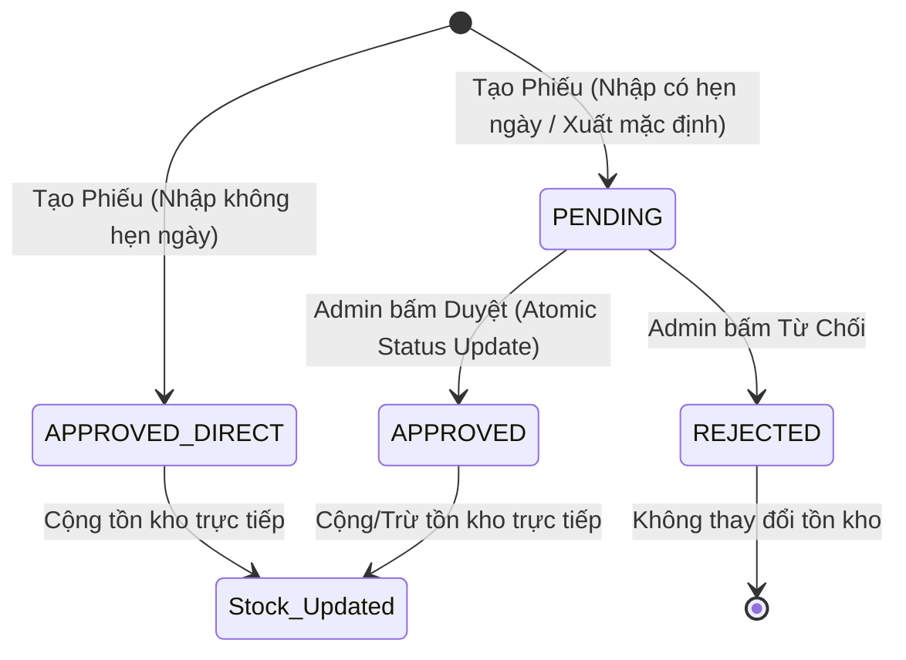

# Tài liệu Kiến trúc Nghiệp vụ Nhập/Xuất Kho (Inventory Module)

Tài liệu này mô tả chi tiết cách thức thiết kế, tổ chức thư mục, kiểm soát đồng thời (concurrency control), và luồng xử lý của hai phân hệ **Nhập kho (Receipts)** và **Xuất kho (Exports)** thuộc hệ thống Gooli WMS.

---

## 📂 1. Cấu trúc thư mục mô-đun Kho

Phân hệ Kho áp dụng mô hình **Symmetrical Module Architecture** (Kiến trúc Module đối xứng) và tách biệt phần logic dùng chung thông qua thư mục `shared/`.

```
backend/src/modules/inventory/
├── shared/                                     # Tầng logic dùng chung (Shared Domain Logic)
│   ├── inventory-shared.module.ts              # Khai báo & export 2 service dùng chung
│   └── services/
│       ├── stock-updater.service.ts            # Xử lý cập nhật tồn kho (tăng/giảm)
│       └── transaction-code-generator.service.ts # Sinh mã phiếu duy nhất (NK/XK)
│
├── receipts/                                   # Phân hệ Nhập kho (Receipts)
│   ├── dto/                                    # Khai báo Validation DTO (create-receipt.dto.ts)
│   ├── receipts.controller.ts                  # Đầu nhận API REST (/receipts)
│   ├── receipts.module.ts                      # Đăng ký module nhập kho (import InventorySharedModule)
│   └── receipts.service.ts                     # Logic nghiệp vụ nhập kho (CRUD)
│
└── exports/                                    # Phân hệ Xuất kho (Exports)
    ├── dto/                                    # Khai báo Validation DTO (create-export.dto.ts)
    ├── exports.controller.ts                   # Đầu nhận API REST (/exports)
    ├── exports.module.ts                       # Đăng ký module xuất kho (import InventorySharedModule)
    └── exports.service.ts                      # Logic nghiệp vụ xuất kho (CRUD)
```

---

## 🔄 2. Luồng Nghiệp vụ Chi tiết

### Sơ đồ Vòng đời Phiếu & Biến động Tồn kho



---

### 📥 A. Quy trình Nhập kho (Receipts)

#### 1. Tạo Phiếu Nhập (`create`)
* **Kiểm tra đầu vào (DTO)**: Ràng buộc kiểu dữ liệu bằng `class-validator` (yêu cầu ít nhất 1 sản phẩm, số lượng nhập $\ge 1$, đơn giá $\ge 0$, định dạng ngày dự kiến, `vatRate` tùy chọn).
* **Xác thực dữ liệu**: Gửi duy nhất 1 câu truy vấn `findMany` để kiểm tra danh sách `productId` của tất cả sản phẩm nhập cùng lúc (tránh lỗi N+1 query).
* **Giao dịch DB (`$transaction` kèm Retry)**:
  1. **Sinh mã phiếu**: Gọi `TransactionCodeGeneratorService.generate('NK', tx)`.
  2. **Tạo phiếu**: Lưu dữ liệu `Receipt` và `ReceiptItem` ở trạng thái:
     - `APPROVED` (nếu không có ngày giao dự kiến) $\rightarrow$ Cộng tồn kho lập tức.
     - `PENDING` (nếu có ngày giao dự kiến) $\rightarrow$ Chờ duyệt sau (chưa ảnh hưởng tồn kho).
  3. **Cộng tồn kho**: Nếu trạng thái phiếu là `APPROVED`, gọi `StockUpdaterService.applyIncrement()`.
  4. **Retry Loop**: Nếu xảy ra lỗi trùng mã định danh (`P2002` trên `code`), toàn bộ transaction sẽ rollback và chạy lại (tối đa 3 lần).

#### 2. Duyệt Phiếu Nhập (`approve`)
* Kiểm tra phiếu tồn tại bằng `findUnique`.
* Khởi chạy **Transaction**:
  - **Duyệt trạng thái phi trạng thái (Atomic status transition)**: Sử dụng `updateMany` kèm điều kiện trạng thái phải đang là `PENDING` để tránh race condition khi hai admin cùng duyệt một phiếu:
    ```ts
    const result = await tx.receipt.updateMany({
      where: { id, status: TransactionStatus.PENDING },
      data: { status: TransactionStatus.APPROVED, approvedById, approvedAt: new Date() }
    });
    if (result.count === 0) throw new BadRequestException('Phiếu đã được duyệt hoặc từ chối.');
    ```
  - Duyệt qua danh sách mặt hàng, thực hiện `applyIncrement()` để cộng dồn tồn kho.

---

### 📤 B. Quy trình Xuất kho (Exports)

#### 1. Tạo Phiếu Xuất (`create`)
* Thực hiện xác thực nhanh sản phẩm (giống Nhập kho).
* Khởi chạy **Transaction kèm Retry** (giống Nhập kho):
  - Sinh mã xuất kho `XK-YYYYMMDD-XXX` và lưu phiếu ở trạng thái mặc định ban đầu là `PENDING` (không ảnh hưởng tồn kho).

#### 2. Duyệt Phiếu Xuất (`approve`)
* Khởi chạy **Transaction**:
  - **Duyệt trạng thái Atomic**: Thực hiện `updateMany` với điều kiện `status: TransactionStatus.PENDING` giống bên nhập kho để đảm bảo trạng thái phiếu chỉ được chuyển đổi duy nhất một lần.
  - Với mỗi mặt hàng cần xuất, gọi `StockUpdaterService.applyDecrement()`.

---

## 🔒 3. Giải pháp Kiểm soát Đồng thời (Concurrency Control) & Thiết kế Hệ thống

### 🔑 A. Chống Trùng mã Phiếu qua Optimistic Retry
* Hệ thống **không sử dụng** `LOCK TABLE` để tránh thắt nút cổ chai (bottleneck) khi hệ thống chịu tải lớn.
* Thay vào đó, sử dụng cơ chế **Optimistic Concurrency Control** (Kiểm soát đồng thời lạc quan): Hệ thống đếm tuần tự và thử tạo phiếu. Nếu phát hiện tranh chấp trùng mã (`code` có ràng buộc `@unique`), Prisma sẽ trả về mã lỗi `P2002`. Khối giao dịch sẽ tự động bắt lỗi và thử lại (retry) tối đa 3 lần với giá trị đếm mới cập nhật.

### 📦 B. Tránh Âm kho & Tranh chấp Tồn kho (Atomic Decrement)
* Mọi thao tác trừ số lượng hàng đều được thực thi trực tiếp bằng toán tử của database (`decrement` trong Prisma) thay vì lấy số lượng về ứng dụng rồi tính toán trừ bằng Javascript (tránh lỗi Lost Update).
* Đối với cả hàng thường (`quantity`) lẫn hàng hỏng (`faultyQty`), hệ thống sử dụng truy vấn atomic `updateMany` có bộ lọc số lượng:
  ```ts
  // Đối với hàng thường
  const result = await tx.stock.updateMany({
    where: { productId, quantity: { gte: quantity } },
    data: { quantity: { decrement: quantity } }
  });
  ```
  Nếu `result.count === 0` (tồn kho không đủ hoặc không tìm thấy sản phẩm), hệ thống mới thực hiện truy vấn `findUnique` phụ để đưa ra thông báo lỗi chi tiết (`NotFoundException` hoặc `BadRequestException`). Cơ chế này đảm bảo tối ưu hóa tốc độ (chỉ tốn 1 truy vấn UPDATE khi thành công) và tuyệt đối chống âm kho.

### 🗄️ C. Ràng buộc duy nhất đối với `upsert` tồn kho
* Trong phương thức `applyIncrement()`, hệ thống gọi `upsert` để khởi tạo bản ghi tồn kho khi nhập sản phẩm lần đầu tiên.
* Để chống lỗi lặp bản ghi (Duplicate key) khi 2 phiếu nhập cùng lúc cho sản phẩm mới, mô hình `Stock` trong schema Prisma sử dụng `productId` làm khóa chính (`productId Int @id`). Điều này đảm bảo có một **UNIQUE constraint** tự nhiên và tuyệt đối trên trường `productId`, đảm bảo `upsert` luôn an toàn dưới mọi điều kiện tải đồng thời.

---

## 📐 4. Các giả định thiết kế & Giới hạn hệ thống

### 🏢 A. Thiết kế Đơn kho (Single Warehouse) - Quyết định có chủ đích
* Bảng `Stock` liên kết quan hệ 1-1 trực tiếp với `Product` qua khóa chính `productId`. Thiết kế này đồng nghĩa với việc hệ thống **chỉ hỗ trợ quản lý một kho vật lý duy nhất**.
* Đây là **quyết định thiết kế có chủ đích** cho phiên bản hiện tại nhằm tối giản hóa cấu trúc dữ liệu và giao diện người dùng. Nếu trong tương lai cần nâng cấp lên mô hình Đa kho (Multi-Warehouse), cấu trúc bảng `Stock` sẽ phải được refactor thành quan hệ Một-Nhiều (hoặc Khóa chính tổ hợp `productId + warehouseId`).

### 🔄 B. Giới hạn Đồng bộ Frontend (Client-side Caching vs Real-time)
* Cơ chế tự động đồng bộ tồn kho dựa trên việc invalidate cache key của TanStack Query (React Query) chỉ có giá trị tức thời đối với **chính trình duyệt của nhân viên thực hiện thao tác**.
* Đối với các client khác trong hệ thống: Dữ liệu trên màn hình sẽ chỉ được cập nhật sau khi họ thực hiện đổi tab, F5 lại trang, hoặc khi cache hết hạn (staleTime = 5 phút).
* *Hướng giải quyết tương lai*: Nếu nghiệp vụ đòi hỏi số liệu tồn kho hiển thị real-time liên tục đa người dùng (ví dụ: nhiều quầy bán hàng đồng thời), hệ thống cần bổ sung cơ chế Polling ngắn (ví dụ: `refetchInterval: 10000`) hoặc kết nối qua WebSockets/Server-Sent Events (SSE).

### 🔑 C. Kế hoạch Idempotency Key cho API Tạo Phiếu
* Để tránh việc tạo trùng phiếu khi client bấm nút nhiều lần hoặc khi mạng bị timeout và tự động gửi lại request (retry):
* *Kế hoạch*: Trong các phiên bản tới, hệ thống sẽ yêu cầu client đính kèm Header `X-Idempotency-Key` khi tạo phiếu nhập/xuất để kiểm tra trùng lặp giao dịch trong vòng 24 giờ.

