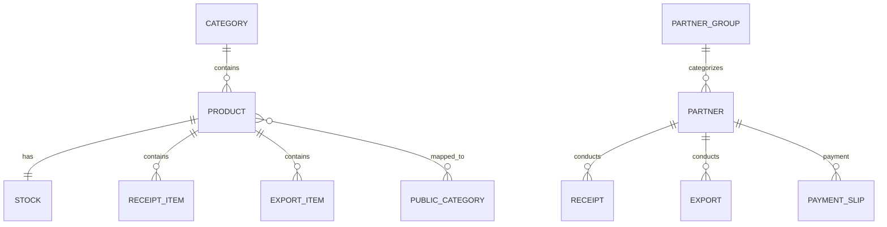

# Tài liệu Kiến trúc Mô-đun Dữ liệu Gốc (Master Data Module)

Tài liệu này mô tả chi tiết thiết kế dữ liệu, các quan hệ thực thể, quy tắc nghiệp vụ kiểm soát tính toàn vẹn, và giải pháp kỹ thuật của mô-đun **Master Data (Dữ liệu gốc)** trong hệ thống Gooli WMS.

---

## 🏗️ 1. Kiến trúc Tổng quan & Sơ đồ ERD

Mô-đun Master Data đóng vai trò là "nguồn sự thật duy nhất" (Single Source of Truth) lưu trữ tất cả các danh mục cốt lõi phục vụ hoạt động Nhập/Xuất kho và Quản lý tài chính dòng tiền.



---

## 📂 2. Cấu trúc Thư mục mô-đun Master Data

Áp dụng mô hình thiết kế độc lập, tách biệt các miền nghiệp vụ (Domain-driven Design) thành các thư mục con rõ ràng:

```
backend/src/modules/master-data/
├── categories/                         # Quản lý Danh mục hàng hóa nội bộ
│   ├── dto/                            # DTO Validation (create/update)
│   ├── categories.controller.ts        # Đầu nhận API REST (/categories)
│   ├── categories.module.ts
│   └── categories.service.ts           # Logic CRUD, sinh slug, chặn trùng
│
├── partners/                           # Quản lý Đối tác (Supplier/Customer)
│   ├── dto/
│   ├── partners.controller.ts          # Đầu nhận API REST (/partners)
│   ├── partners.module.ts
│   └── partners.service.ts             # CRUD, quản lý dư nợ, tích lũy công nợ
│
├── products/                           # Quản lý Sản phẩm (Vật tư)
│   ├── dto/
│   ├── products.controller.ts          # Đầu nhận API REST (/products)
│   ├── products.module.ts
│   └── products.service.ts             # Xử lý đụng độ slug, tạo stock mặc định
│
└── units/                              # Quản lý Đơn vị tính (m², tấm, cây...)
    ├── dto/
    ├── units.controller.ts
    ├── units.module.ts
    └── units.service.ts
```

---

## 🛠️ 3. Chi tiết Nghiệp vụ & Giải pháp kỹ thuật từng Tiểu mô-đun

### 📦 A. Mô-đun Sản phẩm (Products)
Quản lý vòng đời sản phẩm từ kích thước vật lý đến giá cả và cấu hình hiển thị công khai.

1. **Chống đụng độ Slug tự động (Auto-suffix Collision Resolver)**:
   Khi tạo mới hoặc cập nhật tên sản phẩm, slug được sinh tự động bằng hàm `generateSlug` (loại bỏ dấu tiếng Việt, ký tự đặc biệt). Để tránh crash lỗi `@unique` trong DB:
   - Hệ thống tự động kiểm tra sự tồn tại của slug.
   - Nếu đã tồn tại, hệ thống chạy vòng lặp thử lại tối đa 10 lần bằng cách thêm hậu tố tăng dần (`-2`, `-3`, ..., `-10`).
   - Nếu vượt quá 10 lần đụng độ (ví dụ tên sản phẩm trùng nhau quá nhiều), hệ thống sẽ nối thêm một hậu tố gồm 4 số ngẫu nhiên (`-XXXX`) để đảm bảo slug luôn độc bản.
2. **Kiểu dữ liệu tiền tệ chính xác (Decimal Precision)**:
   Để chống sai số lũy kế trong tính toán tài chính kế toán khi nhân giá với số lượng lớn, trường `pricePerM2` được định nghĩa là `@db.Decimal(12, 2)` (sử dụng đối tượng `Decimal` của thư viện `decimal.js` trong NestJS) thay vì kiểu `Float` thông thường.
3. **Các kích thước vật lý & Đơn vị**:
   Hệ thống hỗ trợ lưu trữ độ dày (`thickness`), chiều rộng (`width`), chiều dài (`length`) dưới dạng kiểu `Decimal(10, 2)` phục vụ tính toán thể tích và diện tích thực của vật tư kim loại/trần nhôm.

---

### 👥 B. Mô-đun Đối tác (Partners)
Phân loại đối tác và theo dõi dòng tiền công nợ.

1. **Phân loại vai trò (`PartnerType`)**:
   - `SUPPLIER` (Nhà cung cấp): Đối tượng nhập hàng của Phiếu nhập (`Receipt`) và nhận chi tiền từ Phiếu chi (`PAYMENT`).
   - `CUSTOMER` (Khách hàng / Đại lý): Đối tượng mua hàng của Phiếu xuất (`Export`) và trả tiền qua Phiếu thu (`RECEIPT`).
2. **Quản lý Dư nợ Tích lũy (`totalDebt`)**:
   - Được định nghĩa kiểu `@db.Decimal(12, 2)`.
   - Giá trị này tăng lên khi phát sinh hóa đơn mua/bán chưa trả tiền, và giảm đi tương ứng khi tạo phiếu thu/chi thành công.
   - Trường này được bảo vệ bởi cơ chế khóa dòng Postgres (`FOR UPDATE`) để đảm bảo không bị cập nhật sai lệch khi có nhiều giao dịch tài chính chạy song song.

---

### 📂 C. Danh mục hàng hóa (Categories) & Đơn vị tính (Units)
Đóng vai trò phân cấp dữ liệu tĩnh ở tầng kho nội bộ.

* **Categories (Kho nội bộ)**: Khác với danh mục hiển thị trên website công khai, đây là danh mục phân loại phẳng phục vụ quản lý trong kho.
* **Units (Đơn vị)**: Định nghĩa tập hợp đơn vị tính chuẩn hóa (ví dụ: `m²`, `tấm`, `cây`, `hộp`, `bộ`).

---

## 🔒 4. Quy tắc An toàn dữ liệu & Ràng buộc tính toàn vẹn (Safety Integrity Rules)

Để tránh hiện tượng mồ côi dữ liệu (orphan records) hoặc mất dấu vết lịch sử kho báu dữ liệu, hệ thống áp dụng các luật ràng buộc cứng:

1. **Ngăn chặn xóa danh mục đang chứa sản phẩm**:
   Trước khi xóa một danh mục (`Category`), phương thức `remove()` kiểm tra số lượng sản phẩm liên kết:
   ```ts
   const productsCount = await this.prisma.product.count({ where: { categoryId: id } });
   if (productsCount > 0) throw new ConflictException('Không thể xóa danh mục đã chứa sản phẩm.');
   ```
2. **Cơ chế Soft Delete đối với Sản phẩm**:
   Khi xóa một sản phẩm (`Product`), nếu sản phẩm đó đã từng phát sinh giao dịch nhập/xuất kho (tồn tại trong `ReceiptItem` hoặc `ExportItem`), hệ thống sẽ tự động chuyển trạng thái `isActive: false` thay vì xóa vật lý khỏi database để bảo toàn tính toàn vẹn của lịch sử báo cáo tài chính.
3. **Tự động khởi tạo Tồn kho (Stock Initialization)**:
   Khi tạo mới một sản phẩm thành công, hệ thống luôn khởi tạo một bản ghi tồn kho tương ứng trong bảng `Stock` với số lượng tiêu chuẩn `quantity = 0` và số lượng hàng hỏng `faultyQty = 0` bên trong cùng một Transaction để đảm bảo tính sẵn sàng của dữ liệu.
