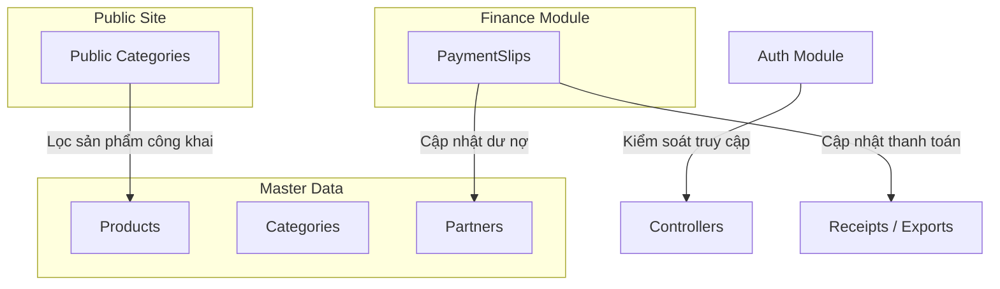

# Tài liệu Kiến trúc Các Mô-đun Hệ thống (Auth, Finance, Master Data, Public APIs)

Tài liệu này cung cấp mô tả kiến trúc chi tiết, sơ đồ luồng dữ liệu, và nguyên tắc lập trình của các mô-đun còn lại trong hệ thống Gooli WMS (chưa qua tái cấu trúc chia tách dịch vụ).

---

## 🏗️ 1. Sơ đồ Tổng quan & Luồng Tương tác

Các mô-đun bổ trợ và dữ liệu gốc bổ sung cho phân hệ Kho (`inventory`) tạo nên bộ khung vận hành hoàn chỉnh cho doanh nghiệp:



---

## 🔐 2. Mô-đun Xác thực & Phân quyền (Auth Module)

Nằm tại [`backend/src/modules/auth/`](file:///d:/Workplace/Gooli/backend/src/modules/auth/).

### Kiến trúc & Quy tắc hoạt động
* **Mô hình**: Kết hợp NestJS `@nestjs/jwt` và Passport `passport-jwt` để triển khai cơ chế xác thực Stateless JWT.
* **Nguyên tắc viết mã**:
  - **Early Return Guard Clauses**: Các phương thức xác thực kiểm tra tuần tự lỗi (Email không tồn tại $\rightarrow$ Trạng thái tài khoản bị khóa $\rightarrow$ Sai mật khẩu) và ném lỗi tức thì bằng `UnauthorizedException`, giảm độ lồng nhau của code.
  - **Validate qua Database**: `JwtStrategy` kiểm tra tính hợp lệ của token bằng cách giải mã payload (`sub: userId`) và truy vấn DB kiểm tra xem tài khoản có còn tồn tại và đang kích hoạt hay không (`user.isActive`).
  - **Thiết lập JWT Expiry**: Sử dụng định dạng `StringValue` (được cast kiểu an toàn `as SignOptions['expiresIn']`) lấy từ biến môi trường `JWT_EXPIRES_IN`.
  - **Bảo vệ Brute-Force**: Áp dụng `@UseGuards(ThrottlerGuard)` ở mức phương thức cho endpoint `/auth/login` để chặn đứng các cuộc tấn công Brute-force vét cạn tài khoản.

---

## 💰 3. Mô-đun Tài chính & Quản lý dòng tiền (Finance Slips Module)

Nằm tại [`backend/src/modules/finance/slips/`](file:///d:/Workplace/Gooli/backend/src/modules/finance/slips/).

### Nghiệp vụ dòng tiền
* **Phiếu thu (`RECEIPT`)**: Chỉ áp dụng cho Khách hàng (`CUSTOMER`).
* **Phiếu chi (`PAYMENT`)**: Chỉ áp dụng cho Nhà cung cấp (`SUPPLIER`).
* **Ràng buộc đầu vào**: DDTO `CreateSlipDto` sử dụng `@IsPositive()` để đảm bảo số tiền thanh toán luôn lớn hơn 0 ở tất cả các request.

### Cơ chế Kiểm soát Đồng thời (Concurrency Control & Row Locking)
Để giải quyết triệt để lỗi Lost Update khi nhiều giao dịch thu/chi xảy ra đồng thời đối với cùng một đối tác hoặc hóa đơn, hệ thống sử dụng cơ chế khóa dòng Postgres bi quan (Pessimistic Row Locking):
1. **Khóa dòng đối tác (`Partner`)**:
   Khi bắt đầu giao dịch `$transaction` để tạo phiếu, hệ thống lập tức thực hiện khóa độc quyền dòng đối tác đó:
   ```sql
   SELECT id FROM "Partner" WHERE id = partnerId FOR UPDATE
   ```
   Lệnh này tuần tự hóa (serialize) tất cả các thao tác cộng/trừ công nợ (`totalDebt`) và thuật toán phân bổ thanh toán FIFO của đối tác này, đảm bảo không có hai luồng xử lý chạy chéo nhau.
2. **Kiểm tra dư nợ hóa đơn liên kết**:
   - Nếu phiếu chi liên kết với hóa đơn nhập (`receiptId`): Kiểm tra dư nợ còn lại của hóa đơn đó. Nếu hợp lệ, cập nhật `paidAmount` và chuyển `paymentStatus` của hóa đơn (`UNPAID` $\rightarrow$ `PARTIALLY_PAID` $\rightarrow$ `PAID`).
   - Nếu số tiền thanh toán vượt quá số nợ còn lại, hệ thống ném ra `ConflictException` (HTTP 409) báo lỗi rõ ràng thay vì im lặng ghi đè hoặc âm nợ hóa đơn.
   - Quá trình này hoàn toàn an toàn nhờ vào khóa dòng `Partner` độc quyền bên trên.

---

## 🗄️ 4. Phân hệ Dữ liệu gốc (Master Data Modules)

Nằm tại [`backend/src/modules/master-data/`](file:///d:/Workplace/Gooli/backend/src/modules/master-data/).

### A. Sản phẩm (Products)
* **Xử lý Đụng độ Slug tự động (Collision Resolution)**: 
  Mỗi sản phẩm khi tạo mới/cập nhật sẽ tự động sinh `slug` từ tên sản phẩm. Để chống lỗi crash trùng khóa duy nhất (`P2002` trên `slug`) khi hai sản phẩm trùng tên hoặc cho ra slug giống nhau, hệ thống thực hiện vòng lặp thử lại tối đa 10 lần bằng cách tự động nối thêm hậu tố số (`-2`, `-3`, ..., `-10`). Nếu vẫn đụng độ, một hậu tố ngẫu nhiên gồm 4 chữ số sẽ được tạo ra để đảm bảo slug luôn duy nhất mà không làm gián đoạn trải nghiệm người dùng.
* **Hỗ trợ tiền tệ chính xác**: Giá sản phẩm được định nghĩa kiểu `Decimal` trong PostgreSQL (`Decimal(12,2)`) thay vì `Float` nhằm loại bỏ hoàn toàn sai số dấu phẩy động trong kế toán.

### B. Đối tác (Partners)
* **Tích lũy công nợ**: Lưu trữ trường nợ tích lũy `totalDebt`. Mọi giao dịch phát sinh (nhập hàng chưa trả tiền tăng nợ, chi tiền trả nợ giảm nợ) đều cộng/trừ trực tiếp vào đây.

### C. Danh mục (Categories) & Đơn vị tính (Units)
* Đóng vai trò danh mục phân loại phẳng hoặc phân cấp để phục vụ lọc/tìm kiếm sản phẩm.

---

## 🌐 5. Mô-đun APIs hiển thị Website (Public Categories Module)

Nằm tại [`backend/src/modules/public-categories/`](file:///d:/Workplace/Gooli/backend/src/modules/public-categories/).

### Cơ chế phục vụ Public Storefront & Bảo mật
* **Tương tác**: Cung cấp API không yêu cầu đăng nhập (`JwtAuthGuard`) để phục vụ SEO và Web công khai (được Next.js gọi ở tầng Server Component).
* **Chống lặp vòng cây danh mục (Cycle Prevention)**: 
  Trong phương thức `saveTree`, hệ thống thực hiện kiểm tra chéo tập hợp các ID danh mục cha và con. Nếu phát hiện một ID danh mục con trùng khớp với danh mục cha trong cấu trúc cây gửi lên, hệ thống sẽ chặn đứng và ném ra `BadRequestException` để ngăn chặn các vòng lặp đệ quy vô hạn (A $\rightarrow$ B $\rightarrow$ A) làm sập API.
* **Bảo vệ lượt xem (Spam Protection)**: 
  API tăng lượt xem danh mục (`POST /public-categories/view`) được bảo vệ bằng `@UseGuards(ThrottlerGuard)` để chống lại các hành vi spam/bot liên tục gọi API để thổi phồng số liệu danh mục thịnh hành giả tạo.

---

## ⚙️ 6. Mô-đun Cài đặt Hệ thống (System Settings Module)

Nằm tại [`backend/src/modules/system-settings/`](file:///d:/Workplace/Gooli/backend/src/modules/system-settings/).

* **Cơ chế**: Lưu trữ cấu hình tĩnh dưới dạng cặp **Key-Value** trong DB (ví dụ: tên công ty, số hotline, địa chỉ, cấu hình kho mặc định).
* **API**: Cho phép đọc cấu hình công khai và chỉnh sửa cấu hình (yêu cầu quyền `ADMIN`).
