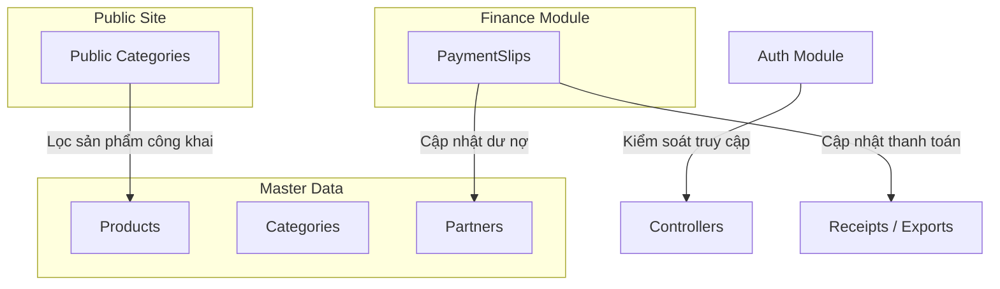

# Tài liệu Kiến trúc Các Mô-đun Hệ thống (Auth, Finance, Master Data, Public APIs)

Tài liệu này cung cấp mô tả kiến trúc chi tiết, sơ đồ luồng dữ liệu, và nguyên tắc lập trình của các mô-đun còn lại trong hệ thống Gooli WMS (chưa qua tái cấu trúc chia tách dịch vụ).

---

## 🏗️ 1. Sơ đồ Tổng quan & Luồng Tương tác

Các mô-đun bổ trợ và dữ liệu gốc bổ sung cho phân hệ Kho (`inventory`) tạo nên bộ khung vận hành hoàn chỉnh cho doanh nghiệp:

---

## 🔐 2. Mô-đun Xác thực & Phân quyền (Auth Module)

Nằm tại [`backend/src/modules/auth/`](file:///d:/Workplace/Gooli/backend/src/modules/auth/).

### Kiến trúc & Quy tắc hoạt động
* **Mô hình**: Kết hợp NestJS `@nestjs/jwt` và Passport `passport-jwt` để triển khai cơ chế xác thực Stateless JWT.
* **Nguyên tắc viết mã**:
  - **Early Return Guard Clauses**: Các phương thức xác thực kiểm tra tuần tự lỗi (Email không tồn tại $\rightarrow$ Trạng thái tài khoản bị khóa $\rightarrow$ Sai mật khẩu) và ném lỗi tức thì bằng `UnauthorizedException`, giảm độ lồng nhau của code.
  - **Validate qua Database**: `JwtStrategy` kiểm tra tính hợp lệ của token bằng cách giải mã payload (`sub: userId`) và truy vấn DB kiểm tra xem tài khoản có còn tồn tại và đang kích hoạt hay không (`user.isActive`).
  - **Thiết lập JWT Expiry**: Sử dụng định dạng `StringValue` (được cast kiểu an toàn `as SignOptions['expiresIn']`) lấy từ biến môi trường `JWT_EXPIRES_IN`.

---

## 💰 3. Mô-đun Tài chính & Quản lý dòng tiền (Finance Slips Module)

Nằm tại [`backend/src/modules/finance/slips/`](file:///d:/Workplace/Gooli/backend/src/modules/finance/slips/).

### Nghiệp vụ dòng tiền
* **Phiếu thu (`RECEIPT`)**: Chỉ áp dụng cho Khách hàng (`CUSTOMER`).
* **Phiếu chi (`PAYMENT`)**: Chỉ áp dụng cho Nhà cung cấp (`SUPPLIER`).

### Cơ chế Liên kết Hóa đơn & Quản lý Công nợ (Transaction Safety)
Khi tạo một phiếu thu/chi, hệ thống chạy trong một **Database Transaction** (`$transaction`) thực hiện tuần tự các bước:
1. **Khớp nối hóa đơn**:
   - Nếu phiếu chi liên kết với hóa đơn nhập (`receiptId`): Kiểm tra dư nợ còn lại của hóa đơn đó. Nếu hợp lệ, cập nhật `paidAmount` và chuyển `paymentStatus` của hóa đơn (`UNPAID` $\rightarrow$ `PARTIALLY_PAID` $\rightarrow$ `PAID`).
   - Nếu phiếu thu liên kết với hóa đơn xuất (`exportId`): Cập nhật trạng thái tương tự trên hóa đơn xuất.
2. **Cập nhật công nợ đối tác (`Partner.totalDebt`)**:
   - Đối với nhà cung cấp (SUPPLIER): Trả tiền (Phiếu chi) sẽ làm **giảm** khoản nợ cần trả của doanh nghiệp (`totalDebt` giảm).
   - Đối với khách hàng (CUSTOMER): Thu tiền (Phiếu thu) sẽ làm **giảm** khoản nợ phải thu của khách hàng (`totalDebt` giảm).

---

## 🗄️ 4. Phân hệ Dữ liệu gốc (Master Data Modules)

Nằm tại [`backend/src/modules/master-data/`](file:///d:/Workplace/Gooli/backend/src/modules/master-data/).

### A. Sản phẩm (Products)
* **Logic Slug độc nhất**: Mỗi sản phẩm khi tạo mới/cập nhật sẽ tự động sinh `slug` từ tên sản phẩm bằng hàm chuyển đổi ký tự tiếng Việt. Trường `slug` có thuộc tính `@unique` để làm đẹp URL tìm kiếm.
* **Hỗ trợ tiền tệ chính xác**: Giá sản phẩm được định nghĩa kiểu `Decimal` trong PostgreSQL (`Decimal(12,2)`) thay vì `Float` nhằm loại bỏ hoàn toàn sai số dấu phẩy động trong kế toán.

### B. Đối tác (Partners)
* **Tích lũy công nợ**: Lưu trữ trường nợ tích lũy `totalDebt`. Mọi giao dịch phát sinh (nhập hàng chưa trả tiền tăng nợ, chi tiền trả nợ giảm nợ) đều cộng/trừ trực tiếp vào đây.

### C. Danh mục (Categories) & Đơn vị tính (Units)
* Đóng vai trò danh mục phân loại phẳng hoặc phân cấp để phục vụ lọc/tìm kiếm sản phẩm.

---

## 🌐 5. Mô-đun APIs hiển thị Website (Public Categories Module)

Nằm tại [`backend/src/modules/public-categories/`](file:///d:/Workplace/Gooli/backend/src/modules/public-categories/).

### Cơ chế phục vụ Public Storefront
* **Tương tác**: Cung cấp API không yêu cầu đăng nhập (`JwtAuthGuard`) để phục vụ SEO và Web công khai (được Next.js gọi ở tầng Server Component).
* **Cây thư mục phân cấp (Hierarchy Tree)**: API trả về danh mục theo dạng cấu trúc cây lồng nhau (`subCategories`), sử dụng quan hệ đệ quy tự tham chiếu (`parentId` liên kết tới `id` cùng bảng).
* **Đồng bộ Lượt xem (Analytics)**: Cung cấp API tăng bộ đếm lượt xem danh mục (`views: { increment: 1 }`) phục vụ thống kê sản phẩm thịnh hành.

---

## ⚙️ 6. Mô-đun Cài đặt Hệ thống (System Settings Module)

Nằm tại [`backend/src/modules/system-settings/`](file:///d:/Workplace/Gooli/backend/src/modules/system-settings/).

* **Cơ chế**: Lưu trữ cấu hình tĩnh dưới dạng cặp **Key-Value** trong DB (ví dụ: tên công ty, số hotline, địa chỉ, cấu hình kho mặc định).
* **API**: Cho phép đọc cấu hình công khai và chỉnh sửa cấu hình (yêu cầu quyền `ADMIN`).
